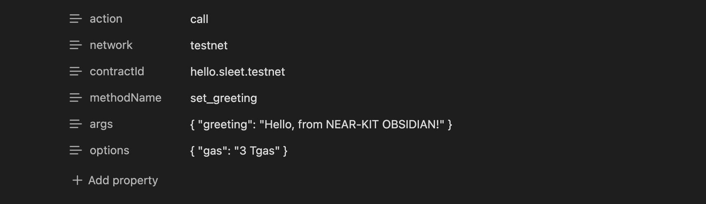

# obsidian-plugin-near-kit
a plugin for obsidian that adds near blockchain interaction for function views, calls and transactions



ℹ️ THIS NEAR PLUGIN SAVES PRIVATE KEYS TO OBSIDIAN BROWSER LOCAL STORAGE. THEY WILL NOT BE SYNCED WITH YOUR VAULT. THE PRIVATE KEYS ARE ACCESSIBLE TO ALL PLUGINS
<br/>
ℹ️ this plugin was make using https://kit.near.tools/ - https://github.com/r-near/near-kit

---

### DEV

```sh
bun i
bun run dev
bun run version
bun run build
bun run tsc -noEmit
```

---


##### DOWNLOAD THE PLUGIN

```sh
cd path/to/vault
mkdir .obsidian/plugins
cd .obsidian/plugins

git clone https://github.com/obsidianplayground/obsidian-plugin-near-kit
cd .obsidian/plugins/obsidian-plugin-near-kit
bun i
bun run build
```

ℹ️ or install directly within obsidian (coming soon)

---

## USE THE PLUGIN
use via obsidian command palette (⌘ + p on mac)

##### COMMANDS

TOGGLE NETWORK (mainnet/testnet)
- toggles the network
- saves network to local storage

SIGN IN
- sign in so you can do transactions
- saves info to local storage

SIGN OUT
- clears plug-in created local storage items

VIEW METHOD
- for view only methods
- does not require sign in
- gets contractId, methodName, and args from file properties
- inserts view results at bottom of the file

CALL METHOD
- for function call transactions
- requires sign in with account id and private key
- inserts tx results at bottom of the file


🧪 test the plugin and see sample markdown files for transactions in my [obsidian-vault-near](https://github.com/obsidianplayground/obsidian-vault-near)

---

copyright 2025 by sleet.near